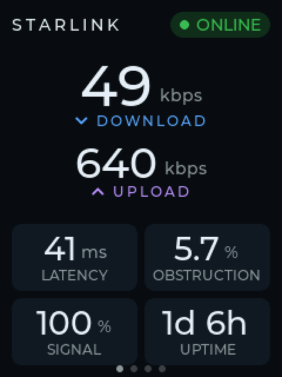
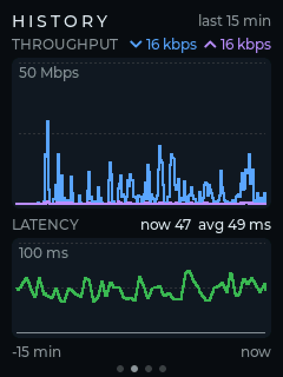
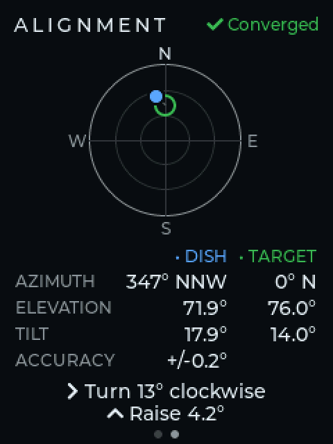
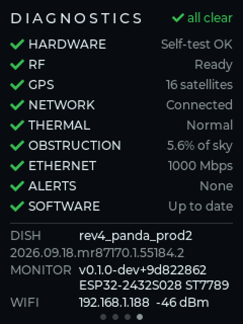
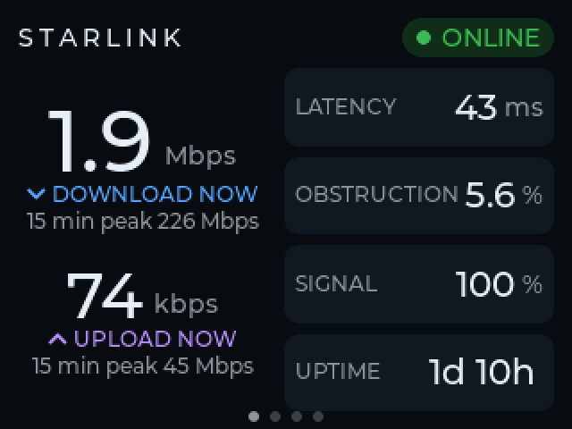

# Starlink Monitor

A standalone Starlink status display for cheap ESP32 touchscreen boards
("Cheap Yellow Display"). It talks directly to your Starlink dish on the
local network. It needs no cloud, no account, no Home Assistant, no MQTT and
no extra server.

> **Status: early development (v0.1.0, Milestone 8 — history).**
> The firmware joins your WiFi and shows live dish status, 15-minute
> history graphs, pointing and diagnostics. Web settings come next.

<p>
  
  
  
  
  
</p>

## Supported hardware

| Board | Display | Touch | Status |
|---|---|---|---|
| ESP32-2432S028 (ST7789) | 2.8" 240×320 ST7789 | XPT2046 | hardware verified |

Notes on board variants and pinouts are in [docs/hardware](docs/hardware/).

## Building

Requires [PlatformIO](https://platformio.org/) (CLI or the VS Code extension).

```sh
cd firmware
pio run -e cyd_2432s028_st7789                 # build
pio run -e cyd_2432s028_st7789 -t upload       # flash over USB
pio device monitor                             # serial log, 115200 baud
```

Host unit tests (decoder and health logic, run with sanitizers):

```sh
pio test -e native
```

If the upload can't find the port, pass `--upload-port /dev/cu.usbserial-XXXX`.
Some boards also need you to hold **BOOT** while the upload starts.

## First-time setup

1. Power the monitor. With no saved network it starts a setup WiFi network
   called `STARLINK-MONITOR-XXXX` and shows that name, a password and a QR
   code on screen.
2. Scan the QR code with your phone, or join that network by hand with the
   password shown on screen.
3. The setup page should open automatically. If it doesn't, browse to
   `http://192.168.4.1`.
4. Pick the WiFi network that can reach your dish. This is usually the
   Starlink router's own network. Enter its password, keep the dish address
   at `192.168.100.1`, and press **Save & connect**.

The monitor remembers the network and reconnects on its own after power
cuts and router reboots. To change WiFi later, **hold the BOOT button for
3 seconds** to reopen setup. If the saved network can't be joined 3 times
in a row after power-up, setup also reopens on its own.

The setup network uses WPA2 with a new random password each time it starts.
The password only appears on the device's own screen (and serial log).

## Using it

- The **dashboard** shows the dish's state (ONLINE, DEGRADED, OFFLINE,
  ERROR or CONNECTING, always as a word and a symbol, not just a colour),
  plus download, upload, latency, obstruction, signal quality and uptime.
  Values the dish doesn't report show as `--`, never as a made-up 0.
- If the dish stops answering, the dashboard switches to an OFFLINE panel
  showing how long ago the dish was last seen, and keeps retrying.
- **Swipe left/right** (or tap the page dots at the bottom) to switch between
  the dashboard, **history**, **alignment** and **diagnostics** pages.
  History graphs the last 15 minutes of download/upload and latency. Right
  after power-up it is filled from the dish's own per-second history, so
  the graphs aren't empty; gaps in the data show as gaps. Diagnostics lists
  hardware self-test, RF, GPS, network, thermal, obstruction, Ethernet,
  other alerts and software update, plus dish and monitor versions and the
  monitor's IP address.
- The **alignment** page Alignment shows where the dish
  points versus where Starlink wants it to point, with plain guidance such
  as "Turn 13° clockwise · Raise 4.2°". It doesn't judge what counts as
  "aligned", because Starlink publishes no tolerance.
- **Long-press the dashboard for 1.5 s** to open the hardware test screen
  (touch, colours, rotation, brightness). Use ◀ to go back.
- **Hold BOOT for 3 s** to open WiFi setup.

## Developer serial commands

At 115200 baud, one command per line:

| Command | Effect |
|---|---|
| `screenshot` | send the current screen (use `firmware/scripts/screenshot.py`) |
| `page <n>` | show page n (0 dashboard, 1 history, 2 alignment, 3 diagnostics) |
| `rotate <r>` | set display rotation 0–3 (not saved) |

```sh
~/.platformio/penv/bin/python firmware/scripts/screenshot.py /dev/cu.usbserial-XXXX shot.png --scale 2
```

## Project layout

```
firmware/            PlatformIO project
  src/hardware/      hardware profiles, driver interfaces, drivers
  src/ui/            LVGL port and screens
  include/lv_conf.h  LVGL configuration
docs/                hardware notes, architecture
```

See [docs/development/architecture.md](docs/development/architecture.md).

## License

MIT — see [LICENSE](LICENSE).
